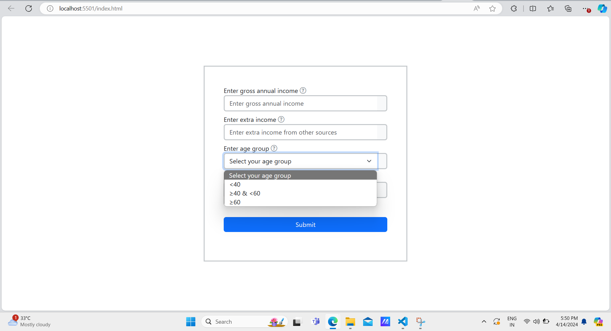
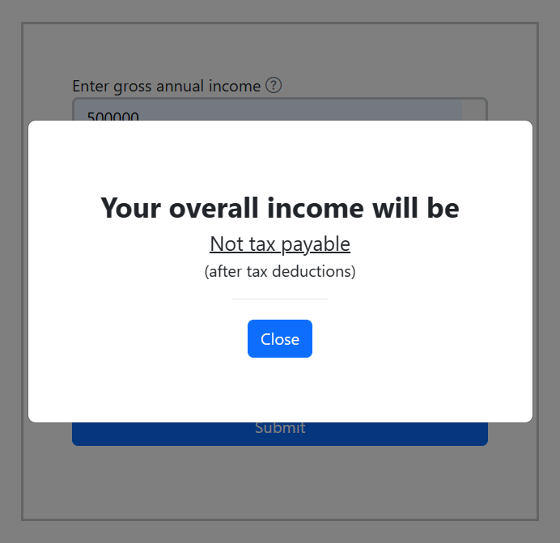
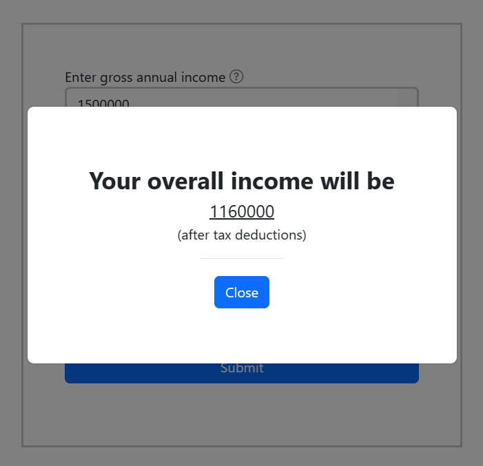
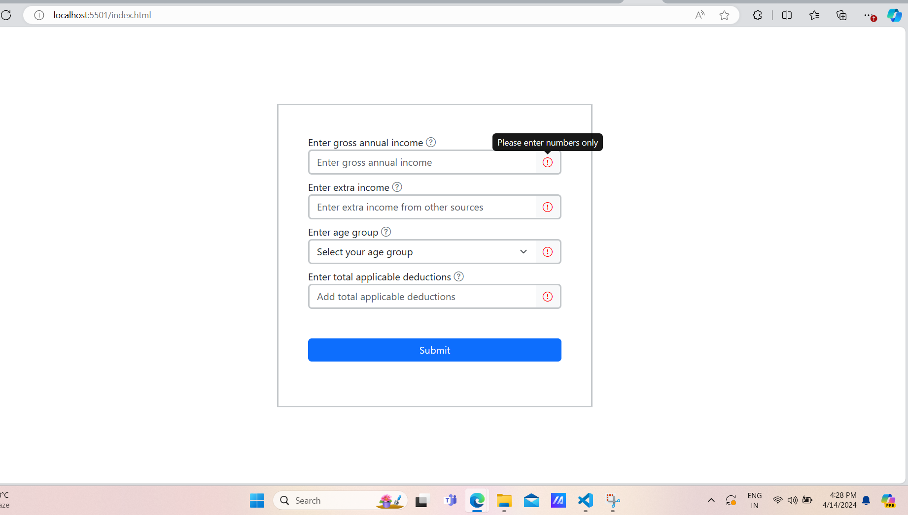
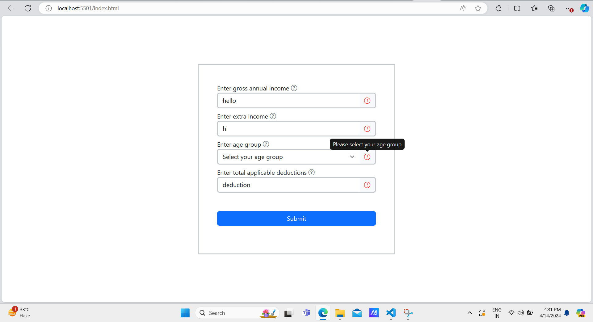

<h1>Tax Calculator</h1>

This is a tax calculator in which you can get your overall income after tax deduction if it is applicable in your case by just doing some little steps by hovering on the tooltip icon which is at the right end of the input element. 

<h3>Some use cases are below</h3>

 (1) Initial look of Tax Calculator 

 (2) For not tax payable 

 (3) For tax payable  

 (4) If user leaves any input field blank 

 (5) If user fills any string in the input field 
